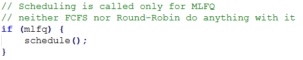

# PedroMarcetFIT-CSE4001-SchedulingStudy

## Design

### First Come First Serve (FCFS)
FCFS is a simple scheduling algorythm that simply
(as its name suggests) allows threads to run in
the order they are set to ready. This algorytm
is fair on arrival time and will perform for
systems where that is important, but will tend to
underperform with systems where there are threads
of varying lengths or when threads requiring
interactivity are present.

### Multi-Level Feedback Queue (MLFQ)
MLFQ is a slightly more advanced scheduling
algorythm. It splits threads into different
queues with varying priority. This allows for
systems where some treads might be more important
to run than others, such as if a thread is
interactive.

## Implementation

### Switching Scheduling Algorythms
For the sake of simplicity two booleans were
added to clock.c that allow for ease of switching
between FCFS, MLFQ, and the defaul Round-Robin.
For Round-Robin both booleans should be false.

### FCFS
FCFS was fortunately easy to implement as most of
the existing code was working in a FCFS manner.
All that was needed was removing the call to 
thread_timeryeild() in clock.c.

### MLFQ
MLFQ was more involved to implement as it needed
a new variable and method. Firstly, the call to
schedule() in clock.c only occurs with MLFQ
turned on, as neither FCFS nor Round-Robin
utilized the method.

There was also an added new field for threads
which worked as their priority. Added in thread.h
and initialized in thread.c

This field was modified when the thread switched
between statuses (thread_switch() in thread.c),
with a switch to ready decreasing its priority
and a switch to sleep increasing its priority.
This is because many I/O programs will require
switching to sleep for obtaining I/O.

And lastly, the actual schedule() method in
thread.c was modified to always put the thread of
highest priority first.

## Testing
For testing the following tests were ran and
measured:
/testbin/add, /testbin/matmult, /testbin/hog, /testbin/farm, /testbin/schedpong

### Add
Round-Robin:

FCFS:

MLFQ:

### Matmult
Round-Robin:

FCFS:

MLFQ:

### Hog
Round-Robin:

FCFS:

MLFQ:

### Farn
Round-Robin:

FCFS:

MLFQ:

### Schedpong
Round-Robin:

FCFS:

MLFQ:

